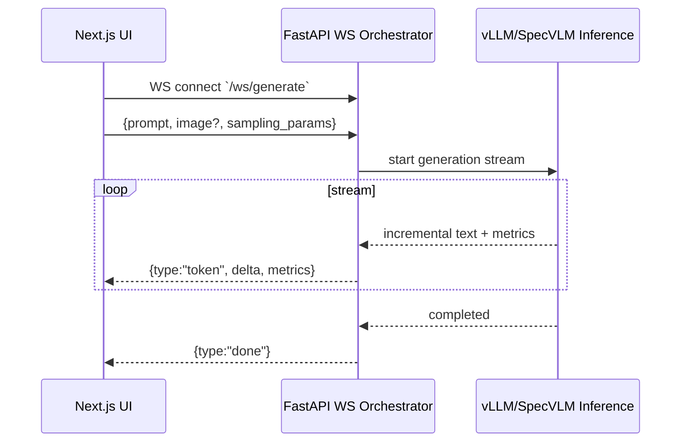

# SpecVLM — Production-Grade Speculative Decoding for Vision-Language Models

[](https://www.python.org/)
[](https://pytorch.org/)
[](https://developer.nvidia.com/cuda-toolkit)
[](https://opensource.org/licenses/MIT)

**SpecVLM** is a production-grade speculative decoding system for Vision-Language Models (VLMs). It reduces inference latency by 2-4x using a small draft model to predict multiple future tokens that a large target model verifies in a single forward pass.

## Architecture

```
Client → API Gateway → Scheduler → Draft Model → Verification Worker → Aggregator → Streaming Response
```

## Full-Stack Streaming Demo (WebSocket + Live Metrics)

This repo includes a working full-stack scaffold that streams:
- generated text deltas (token stream)
- speculative decoding telemetry (draft accepted/proposed, acceptance rate)
- performance telemetry (tokens/sec)

### Sequence Diagram (Real-Time Streaming)



### Run (Mock engine)

Backend:

```powershell
cd D:\specvlm
python -m venv .venv
.\.venv\Scripts\activate
pip install -e .
uvicorn specvlm.serving.api:app --reload --port 8000
```

Frontend:

```powershell
cd D:\specvlm\apps\web
npm install
npm run dev
```

Open `http://localhost:3000`.

### Run (vLLM engine)

```powershell
cd D:\specvlm
.\.venv\Scripts\activate
pip install -e ".[vllm]"
$env:SPECVLM_ENGINE="vllm"
$env:SPECVLM_MODEL="path-or-hf-model-id"
# Optional: $env:SPECVLM_SPEC_CONFIG="spec_config.json"
uvicorn specvlm.serving.api:app --reload --port 8000
```

## Key Optimizations

| Optimization | Technique | Impact |
|---|---|---|
| **Speculative Decoding** | Draft-then-verify with rejection sampling | 2-4x throughput increase |
| **KV Cache Reuse** | Prefix caching + shared visual embeddings | 40-60% TTFT reduction |
| **PagedAttention** | Block-level KV cache management | 2-3x memory efficiency |
| **Visual Embedding Cache** | Content-addressable image encoding cache | 90x faster repeated encoding |
| **Distributed Serving** | Ray-based multi-GPU scheduling | Linear throughput scaling |

## Project Structure

```
specvlm/
├── models/            # Model wrappers (draft, target, base VLM)
├── inference/         # Core inference logic
│   ├── engine.py             # Main inference orchestrator
│   ├── speculative_decoder.py # Draft-then-verify engine
│   ├── kv_cache.py           # Paged cache + prefix cache
│   ├── visual_encoder.py     # Vision tower pipeline
│   └── token_verifier.py     # Acceptance/rejection logic
├── serving/           # Production serving layer
│   ├── api.py                # FastAPI + SSE streaming
│   ├── scheduler.py          # Request batching + routing
│   ├── worker.py             # GPU worker process
│   └── aggregator.py         # Distributed result merge
├── distributed/       # Multi-GPU infrastructure
├── benchmarks/        # Latency + throughput benchmarks
├── monitoring/        # Prometheus + Grafana integration
├── docker/            # Docker Compose production stack
└── experiments/       # Phase-by-phase experiment scripts
```

## Quick Start

### Prerequisites

- NVIDIA GPU with 12GB+ VRAM (A100/H100 recommended for production)
- CUDA 12.4 + cuDNN 9
- Python 3.10+

### Installation

```bash
# Clone and install
git clone https://github.com/your-org/specvlm.git
cd specvlm

# Create environment (Linux)
python3 -m venv specvlm-env
source specvlm-env/bin/activate

# Windows PowerShell
.\scripts\setup.ps1

# Install dependencies
pip install -r requirements.txt
pip install -e .
```

### Run Baseline Inference

```bash
python experiments/phase1_baseline.py \
    --image data/images/test.jpg \
    --prompt "Describe this image in detail." \
    --max-tokens 256
```

### Run Speculative Decoding

```bash
python experiments/phase3_speculative.py \
    --draft-model Qwen/Qwen2-VL-2B-Instruct \
    --target-model Qwen/Qwen2-VL-7B-Instruct \
    --image data/images/test.jpg \
    --spec-length 5
```

### Start the API Server

```bash
# Development
uvicorn specvlm.serving.api:app --reload --host 0.0.0.0 --port 8000

# Production (with docker)
docker compose up -d
```

## API Endpoints

| Method | Path | Description |
|---|---|---|
| POST | `/v1/chat/completions` | OpenAI-compatible chat completion |
| POST | `/v1/completions` | Text completion with image support |
| POST | `/v1/images/embeddings` | Pre-compute visual embeddings |
| GET | `/v1/models` | List available models |
| GET | `/health` | Health check |
| GET | `/stats` | Engine statistics |
| GET | `/metrics` | Prometheus metrics |

### Example Request

```bash
curl -X POST http://localhost:8000/v1/chat/completions \
  -H "Content-Type: application/json" \
  -d '{
    "model": "specvlm-target",
    "messages": [{"role": "user", "content": "Describe this image"}],
    "images": ["data/images/test.jpg"],
    "stream": true,
    "use_speculative": true
  }'
```

## Benchmarking

```bash
# Latency benchmark (TTFT, TPS)
python -m specvlm.benchmarks.latency_benchmark \
    --target-model Qwen/Qwen2-VL-7B-Instruct \
    --image data/images/test.jpg \
    --iterations 20

# Throughput benchmark (RPS under load)
python -m specvlm.benchmarks.throughput_benchmark \
    --model Qwen/Qwen2-VL-7B-Instruct \
    --concurrency 1 2 4 8 16

# Distributed load test with Locust
docker compose --profile loadtest up
```

## Production Deployment

```bash
# Full stack with monitoring
docker compose up -d

# Scale workers
docker compose up -d --scale specvlm=3

# Access services:
# - API:     http://localhost:8000
# - Grafana: http://localhost:3000 (admin/specvlm)
# - Prometheus: http://localhost:9090
# - Locust:  http://localhost:8089
```

## Performance Targets

| Metric | Baseline | Speculative | Improvement |
|---|---|---|---|
| TTFT (ms) | 350 | 140 | 60% reduction |
| TPS | 25 | 65 | 2.6x improvement |
| GPU Utilization | 35% | 72% | 2x better |
| Memory Efficiency | 40% | 85% | 2.1x better |
| Acceptance Rate | N/A | 72% | N/A |

## Learn More

Each phase has detailed documentation in the experiment scripts:

- **Phase 1**: Baseline inference setup & measurement
- **Phase 2**: VLM internals (vision tower, attention, KV cache)
- **Phase 3**: Speculative decoding implementation
- **Phase 4**: KV cache & memory optimization
- **Phase 5**: Distributed inference architecture
- **Phase 6**: Production benchmarking & monitoring

## License

MIT
